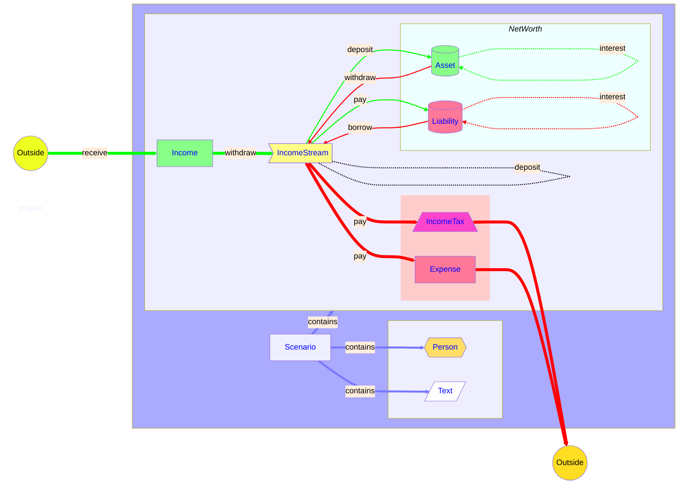

# Our Data Model

Our simulation operates on one or more scenarios. Each scenario contains information about
how [[Income]] and [[Expense|Expenses]]]] vary with time (cash flow), and what [[Asset|Assets]]
and [[Liabilities]] we have available (net worth).

These are connected via [[IncomeStream|IncomeStreams]], which represent strategies for moving
funds between destinations.

In addition, a scenario contains information about the [[Person|People]] involved,
[[TextItem|Text Items]] used to construct explanations that vary over time, as well
as allowing personalized explanations while maintaining privacy and security.

This diagram shows how these elements relate. You can click on the items for more information.

<!-- Note: Blank lines cannot be used below! -->

## The Model Elements

* [[Scenario]] A distinct scenario to be simulated.
  * [[Snapshot]] captures the state of an entire [[Scenario]] at a point in time.
* [[Person]], typically individual or spouses or domestic partners.
* [[Income]], a source of new income
* [[Expense]], something that costs money
* [[Asset]], something that we own. This can be something that can be potentially sold, such as a house or car, or an investment.
* [[Liability]], something that we need to pay in the future or over time. This can be loan, or
  a committed expense, such as needed maintenance.
* [[IncomeStream]], a plan combining [[Income]] and drawing down [[Asset|Assets]],
  to supply funds to meet [[Expense|Expenses]].
* [[IncomeTax]], information to estimate income-based taxes that will need to be paid.
* [[TextItem]], arbitrary user-supplied text to be used where needed.
